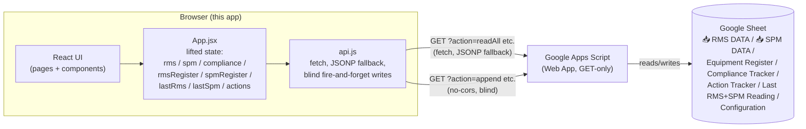

# Architecture

## The big picture

There is no server this app owns or hosts. The React app is a static site
(built with Vite) that talks directly, from the browser, to a Google Apps
Script Web App URL — every request is a `GET`, never a `POST` (see
[API_CONTRACT.md](./API_CONTRACT.md) for why, and for the fetch/JSONP
transport details).

## State is lifted to one place

`App.jsx` holds every data array — `rms`, `spm`, `compliance`,
`rmsRegister`, `spmRegister`, `lastRms`, `lastSpm`, `actions` — in
`useState`, loaded once via `readAll()` (on mount, 800ms after the app's
config/theme/threshold-overrides finish loading from `localStorage`, and
again whenever any "Sync" button is clicked) and passed down as props.
Every write (the `mutations` object: `addRMS`/`updateRMS`/`deleteRMS`/
`addSPM`/`updateSPM`/`deleteSPM`) also lives in `App.jsx`, so every page
that touches readings shares the exact same in-memory copy — there's no
per-page re-fetching to keep in sync.

Two derived maps get built once in `App.jsx` and threaded everywhere:
`rmsRegMap`/`spmRegMap` (Equipment Register rows keyed by equipment ID) and
`registryMap` (the two merged into one record per equipment, used for
display fields like line/eqType that either side might supply). Every
page's own filter dropdowns and lookups build off these rather than
re-deriving them.

## Threshold resolution has a specific precedence

`domain.js`'s `resolveThresholds(overrides, equipmentId, rmsRegisterMap,
spmRegisterMap)` decides which Good/Acceptable/Alarm (RMS) or
Normal/Caution (SPM) cutoffs apply to one equipment, and the precedence is
not "local override always wins":

1. If the Equipment Register has an entry for this equipment (on the RMS
   side, independently from the SPM side), its `rmsGood`/`rmsAcceptable`/
   `rmsAlarm` values are used, full stop.
2. Only if there's **no** register entry for that side does the local
   per-equipment override (persisted to `localStorage` under
   `vib_thresholds_v3`, edited from the Limits Settings page) get merged
   over `DEFAULT_THRESHOLDS`.

In practice this means **Limits Settings only visibly changes anything for
equipment that isn't in the RMS/SPM Equipment Register at all** — for
registered equipment (the common case), the bands used everywhere
(Dashboard, New Reading, Equipment Readings, Graphs, Action Tracker's
Generate Monthly Actions) come from Equipment Register's own Edit modal
(`updateRegisterLimits`), not from Limits Settings. This is reproduced
exactly as found in the original bundle's `ut()` function — not a bug
introduced in this rebuild, though it does mean Limits Settings' own UI
doesn't make this precedence obvious to a user.

## Two status vocabularies, deliberately not identical

RMS readings are banded into 4 words (Good/Acceptable/Alarm/Danger); SPM
readings into 3 (Normal/Caution/Danger — there is no distinct SPM "Alarm"
band despite the Equipment Register and Limits Settings both collecting an
`spmAlarm`/`spmCaution` limit; see
[API_CONTRACT.md](./API_CONTRACT.md#known-gaps) for what actually happens
to that value on save). `domain.js`'s `spmToRmsStatus()` maps the SPM words
onto RMS-ranked equivalents (Normal→Good, Caution→Acceptable, Danger→Alarm)
so a `SEVERITY_RANK` lookup can compare and combine them — an equipment
with one bad RMS point and one bad SPM point gets whichever is more severe
as its overall Dashboard status. The two vocabularies also get **different
colors** for their own "worst" band: RMS Danger renders `purple` (visually
distinct from Alarm's red); SPM Danger renders plain `danger` (red).
`rmsColorKey()`/`spmColorKey()` keep this asymmetry rather than smoothing
it into one shared color map.

## Reading writes cascade into three places

Saving one RMS or SPM reading (from New Reading or Equipment Readings) does
three separate writes, all blind/unverified (see
[API_CONTRACT.md](./API_CONTRACT.md)):

1. **`append`/`updateRow`** to the raw `📥 RMS DATA`/`📥 SPM DATA` sheet —
   the permanent history.
2. **`upsertLastRMS`/`upsertLastSPM`** — recomputes that point's status
   (`rmsStatus()`/`spmStatus()`) and overwrites the equipment+point's row
   in the Last Reading sheet, so the Dashboard reflects the new reading
   without a full re-sync. Deleting the only remaining reading for an
   equipment+point instead fires `deleteLastRMS`/`deleteLastSPM` and clears
   it from local state; deleting one of several fires an upsert with
   whichever remaining reading is now most recent.
3. **New Reading only** — after saving at least one point, also fires
   `updateCompliance` for that equipment+month with whichever reading's
   status was most severe (`worseStatus()` reduced across every point just
   saved, RMS and SPM together), and locally marks that month `"YES"` in
   the in-memory compliance array so the Compliance Tracker reflects it
   immediately.

## Theming

The original ships a `new Proxy({}, { get(target, key) { ... } })` as its
style/theme namespace — every property access (`a.T`, `a.btn`, `a.card`,
...) is computed live off a module-level `let Tt` that gets reassigned when
the theme switches, so every already-mounted component picks up new colors
on the next render without re-deriving anything itself. This rebuild uses
React Context instead (`ThemeContext.jsx`'s `ThemeProvider`/`useTheme()`,
matching the sibling oil-analysis app's own convention) — genuinely
equivalent behavior (every consumer re-renders with fresh colors on a theme
switch), expressed idiomatically rather than as a literal Proxy port.
`theme.js`'s `THEMES` holds the exact 8 palettes (`Navy Dark` default, plus
`Midnight Blue`, `Forest Green`, `Carbon Dark`, `Slate Light`, `Pearl
White`, `Sky Blue`, `Warm Sand`) read directly out of the bundle's own
theme object — every hex value here is real, not approximated.
`buildStyles(T)` is the shared style-object set (`s.card`, `s.btn`,
`s.input`, etc.) the Proxy's `get()` branches built inline; it's
recomputed once per theme change, in `ThemeProvider`, and handed to every
component as `s`.

## Known gaps

See [API_CONTRACT.md](./API_CONTRACT.md#known-gaps) for the write-related
gaps (no write verification, `updateAction`'s inconsistent payload shape,
Limits Settings' SPM Alarm bug, the non-functional passcode, the unwired
auto-sync config fields) — all reproduced from the original bundle, not
introduced by this rebuild. Two more, specific to this document's scope:

- **The Compliance Tracker sheet's actual column layout is inferred, not
  confirmed** — see [SHEET_SCHEMA.md](./SHEET_SCHEMA.md#compliance-tracker-inferred).
  The backend hands the client already-reshaped per-equipment/per-month
  JSON, so this app never sees (or needs to reconstruct) the raw sheet.
- **This rebuild adds an `ErrorBoundary`** (`components/ErrorBoundary.jsx`)
  that the original doesn't have at all — an uncaught render error in the
  original blanks the page with no message. Everything else in
  `src/components/` and `src/pages/` is a direct port of a real component
  in the minified bundle.

See [CODE_GUIDE.md](./CODE_GUIDE.md) for a file-by-file walkthrough.
